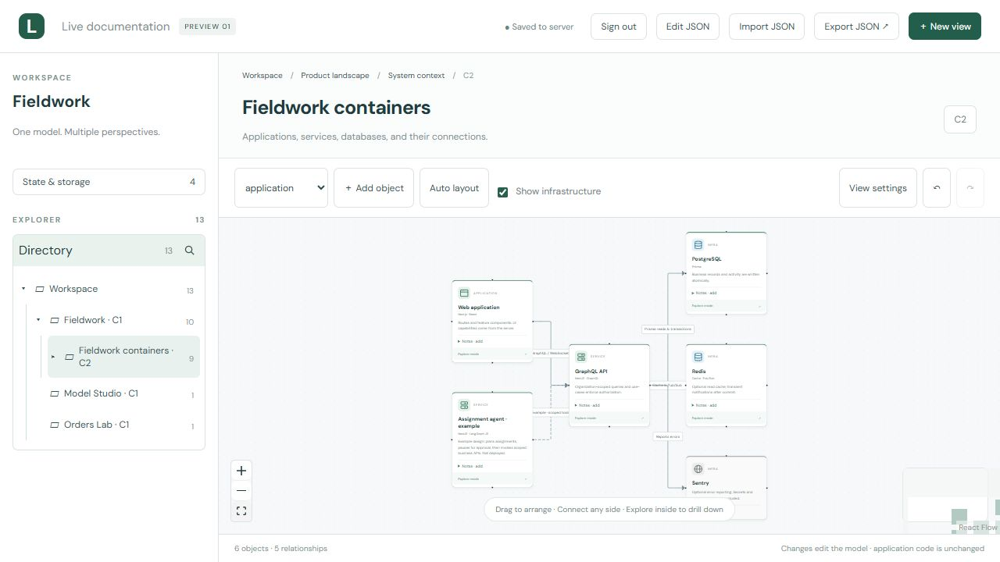
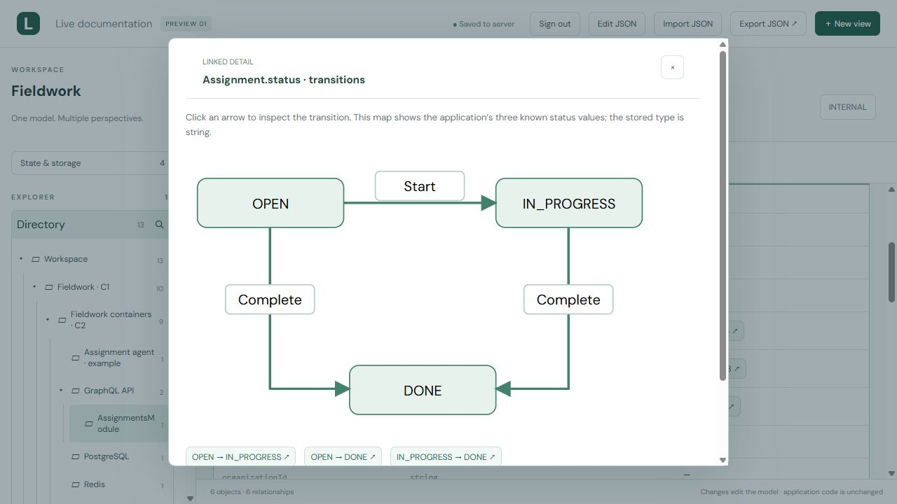

# Live documentation

**A connected map of your software, for people and coding agents.**

[Getting started](docs/getting-started.md) · [User guide](docs/user-guide.md) · [Deployment](docs/deployment.md) · [Agent workflow](AI-WORKFLOW.md) · [Roadmap](docs/roadmap.md)

Follow a system from its architecture diagram into modules, domain objects, API operations, policies, state transitions, and frontend components. Keep those views together in one editable model, with source references that make the documentation easier to check.

Live documentation runs in a **single Next.js + SQLite container**. People arrange the canvas and edit validated JSON. Coding agents read the live model, compare it with source code, and publish changes through the same revision-protected API.



*An actual screen from the bundled Fieldwork example. The diagram documents a sample application; PostgreSQL and Redis are not dependencies of Live documentation itself.*

## Follow the question, not the file tree

| When you need to understand… | Open… |
| --- | --- |
| What runs and how it connects | C4-style architecture canvases with drill-down views |
| What a module owns and exposes | Domain tables, actions, and the Module API index |
| Why an operation is allowed | Linked policies, guards, and derived permissions |
| What happens when state changes | State maps and transition details |
| How a page gets its data | Layouts, component trees, props, and API contracts |
| What is stored or published | Database tables and Redis key/channel examples |
| How an agent workflow branches | An editable graph with routing and node details |



## Built for ongoing documentation

- **Arrange visually.** Move cards, connect their sides, edit arrows, add notes, and reveal module relations on demand.
- **Edit precisely.** JSON drafts use a shared schema and reference checks. Wrong types and broken references block saving.
- **Preserve work.** SQLite persistence, revision conflicts, recovery drafts, undo/redo, and JSON export help protect edits.
- **Give agents context.** Pull a model, inspect its sources, validate a proposal, and publish against the revision you read.
- **Keep ownership.** Self-host the app and export your model as JSON. No external AI account is required to run it.

“Live” means the shared model can be read and updated through its API. The app **does not automatically watch repositories or guarantee that documentation matches code**. A person or coding agent performs that review. See the [agent workflow](AI-WORKFLOW.md).

## Run it locally

Requires **Node.js 24+** and npm.

```sh
git clone https://github.com/zhubek/live-documentation.git
cd live-documentation
npm ci
cp .env.example .env.local
```

Set `STUDIO_PASSWORD` and `STUDIO_SESSION_SECRET` in `.env.local` to separate random values, then run:

```sh
npm run dev
```

Open **http://localhost:5185** and sign in. On PowerShell, use `Copy-Item .env.example .env.local`. For a single-container setup, follow the [Docker deployment guide](docs/deployment.md).

Fieldwork and Orders Lab work without another checkout. A larger [Smart Bolashaq example](examples/sb2/README.md) demonstrates source-linked Next.js pages, NestJS APIs, and database documentation.

## Current product status

**Early self-hosted preview · version 0.1.0.** Access uses one shared password for a trusted team. Individual accounts, role-based access, separate customer workspaces, live collaborative editing, billing, and a hosted commercial service are not included.

We are developing Live documentation as a commercial product with an open-source foundation. Direction and gaps are in the [roadmap](docs/roadmap.md). Pricing, service commitments, and launch dates have not been announced.

[Discuss a pilot or integration](https://github.com/zhubek/live-documentation/issues/new?title=Pilot%20or%20integration%20enquiry) · [Request a feature](https://github.com/zhubek/live-documentation/issues/new?title=Feature%20request) · [Report a bug](https://github.com/zhubek/live-documentation/issues/new?title=Bug%20report)

GitHub issues are public. Share requirements there, not private models or credentials.

## Documentation

| Guide | Covers |
| --- | --- |
| [Getting started](docs/getting-started.md) | Installation and your first model |
| [User guide](docs/user-guide.md) | Canvas, JSON editing, views, and recovery |
| [Deployment](docs/deployment.md) | Configuration, Docker, HTTPS, backups, and upgrades |
| [Architecture](docs/architecture.md) | Application, persistence, and model boundaries |
| [Model and API](docs/api.md) | Schema, endpoints, validation, and revision conflicts |
| [Coding-agent workflow](AI-WORKFLOW.md) | Read, verify, validate, publish, and re-read |
| [Security](SECURITY.md) | Access boundaries and private vulnerability reports |
| [Contributing](CONTRIBUTING.md) | Development checks and contribution expectations |
| [Changelog](CHANGELOG.md) | Published capabilities |

## License

[MIT](LICENSE). You may use, modify, distribute, and sell the software under its terms; retain its copyright and permission notice. Dependencies retain their [own licenses](docs/third-party.md).

Originally developed as Fieldwork Model Studio. Existing model IDs, API routes, environment variable names, and browser storage keys remain compatible.
