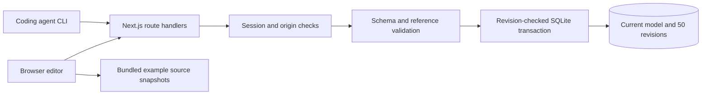

# Application architecture

Live documentation is one Next.js application that reads and writes SQLite directly. It does not need a separate NestJS API or BFF.

## Code map

| Location | Responsibility |
| --- | --- |
| `src/main.jsx` | Shared-model editor, canvases, selection, imports, and JSON editing |
| `src/StudioBackend.jsx` | Sign-in, autosave queue, recovery drafts, conflicts, and revision notifications |
| `src/model-schema.js` | JSON Schema and nested type validation using AJV |
| `src/model.js` | Model operations, templates, and semantic reference checks |
| `app/api/` | Session, model, schema, validation, and health endpoints |
| `server/auth.js` | Shared-password and signed-session implementation |
| `server/store.js` | SQLite, revision-checked writes, and history retention |
| `studio-client.mjs` | Agent-facing pull, schema, validate, and push commands |
| `public/` | Example source and database-schema snapshots |
| `examples/sb2/` | Importable documentation for a pinned source revision |

## One model, multiple views

Objects have stable IDs and shared metadata. Relations connect object IDs. Views select objects, store positions, and link to more detailed views. An object edit affects all its views; dragging changes positions in the relevant view.

Structured payloads describe frontend pages (`pageSpec`), backend modules (`moduleSpec`), database tables (`databaseSchema`), explanatory sections (`documentation`), and agent graph layout/appearance (`agentCanvas`). The schema is the authoritative contract.

Fieldwork migration flags and browser storage keys preserve compatibility with earlier Model Studio exports. Product branding does not change model identity.

## A write from draft to storage

1. The editor parses a draft and validates types and references.
2. Applying the draft updates local model state and schedules saving.
3. The browser sends the complete model and its base revision.
4. The server checks session, origin, request size, schema, and references.
5. SQLite starts a transaction and compares stored and submitted revisions.
6. A match saves the model and history entry atomically. A mismatch rolls back with HTTP 409.

Browser writes are serialized. A recovery draft never automatically replaces a newer server model. Undo/redo is local to the editing session.

## What source-backed means

The Fieldwork source map is generated from selected files. SB2 links its claims to a pinned commit. Neither establishes a permanent repository connection.

A coding agent can inspect current source and update the model using the [agent workflow](../AI-WORKFLOW.md). It remains responsible for factual correctness. The app validates structure, not correspondence to source code.

Policies, transactions, queues, and workflows in the documentation belong to the documented application. Live documentation does not execute them.
